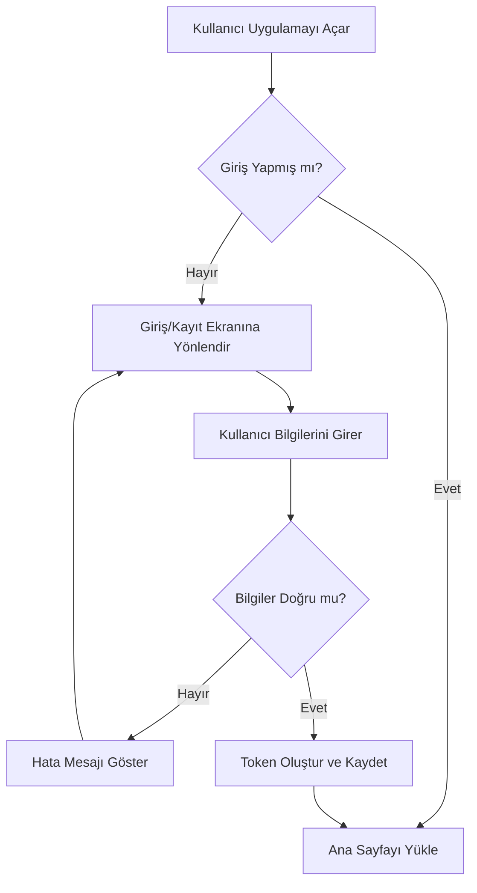

# Proje Algoritmaları ve Mimari Yapısı

Bu doküman, projeye dahil edilen temel algoritmaların, iş kurallarının (business logic) ve veri akışlarının dokümante edilmesi amacıyla oluşturulmuştur.

## 1. Örnek Akış (Kullanıcı Girişi / Yetkilendirme)

Aşağıdaki şema, örnek bir algoritma akışını göstermektedir. Uygulamaya yeni özellikler ekledikçe bu şemaları güncelleyebilir veya yenilerini ekleyebiliriz.

## 2. [Buraya Algoritma Adı Gelecek]

*(Buraya üzerinde çalıştığınız veya planlamak istediğiniz yeni bir algoritmanın adımlarını ve diyagramını ekleyeceğiz. Lütfen hangi mantığı tasarlamak istediğinizi bana anlatın, burayı ona göre dolduralım.)*

---

**Nasıl Kullanılır:**
- Yeni bir algoritma eklemek istediğinizde, mantığını bana kısaca anlatın.
- Ben bu dokümana yeni bir bölüm ve görsel akış şeması (Mermaid) olarak ekleyeceğim.
