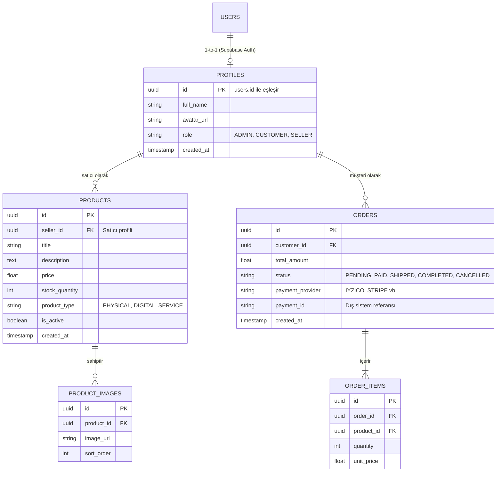

# Veritabanı Şeması (Database Schema & ERD)

Bu doküman, sistemin veri yapısını modeller. Her şeyi adım adım ve modüler bir şekilde inşa edeceğimiz için, tabloları amaçlarına göre gruplandırdık.

> **Esneklik Notu:** Pazar yerinde ağırlıklı olarak fiziksel ürün satılacak ancak ileride "danışmanlık/hizmet" satışlarına da olanak tanımak için `product_type` adında bir alan (enum) kullandık.

## 1. Varlık İlişki Diyagramı (ER Diagram)

Aşağıdaki şema, Supabase üzerindeki temel tablolarımızın birbirine nasıl bağlandığını gösterir.

## 2. Tasarım Kararları (Architecture Decisions)

1. **Ödeme Altyapısı (Iyzico Soyutlaması):** Ödeme sağlayıcısı olarak Iyzico düşünülse de, `ORDERS` tablosunda `payment_provider` alanı açtık. İleride cüzdan sistemi veya Stripe eklemek istersek veritabanını yıkıp baştan yapmamıza gerek kalmayacak.
2. **Ürün Çeşitliliği:** `product_type` alanı sayesinde aynı tablo üzerinden hem fiziksel hem de hizmet/danışmanlık satışı yönetilebilecek. Eğer kargo gerekiyorsa sadece `PHYSICAL` ürünler için adres/kargo takibi adımları devreye girecek.
3. **Rol Yönetimi (RBAC):** Bir kullanıcı hem alıcı hem satıcı olabilir. Bunu `PROFILES` tablosundaki `role` alanı ile yöneteceğiz.

---
*Bu şema, backend ve frontend tarafındaki TypeScript arayüzlerinin (`interfaces/types`) temelini oluşturacaktır.*
